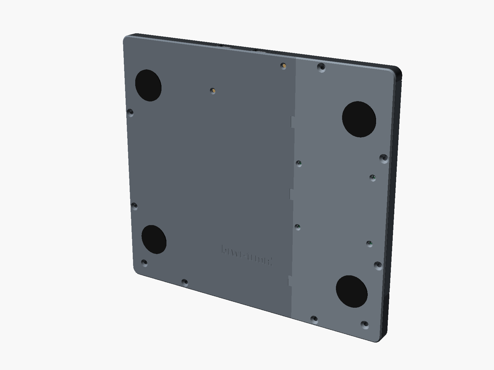
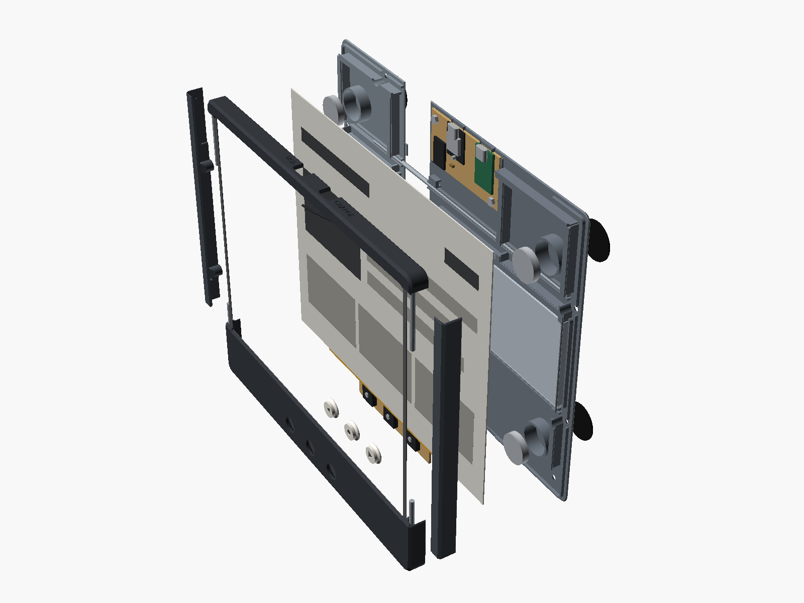
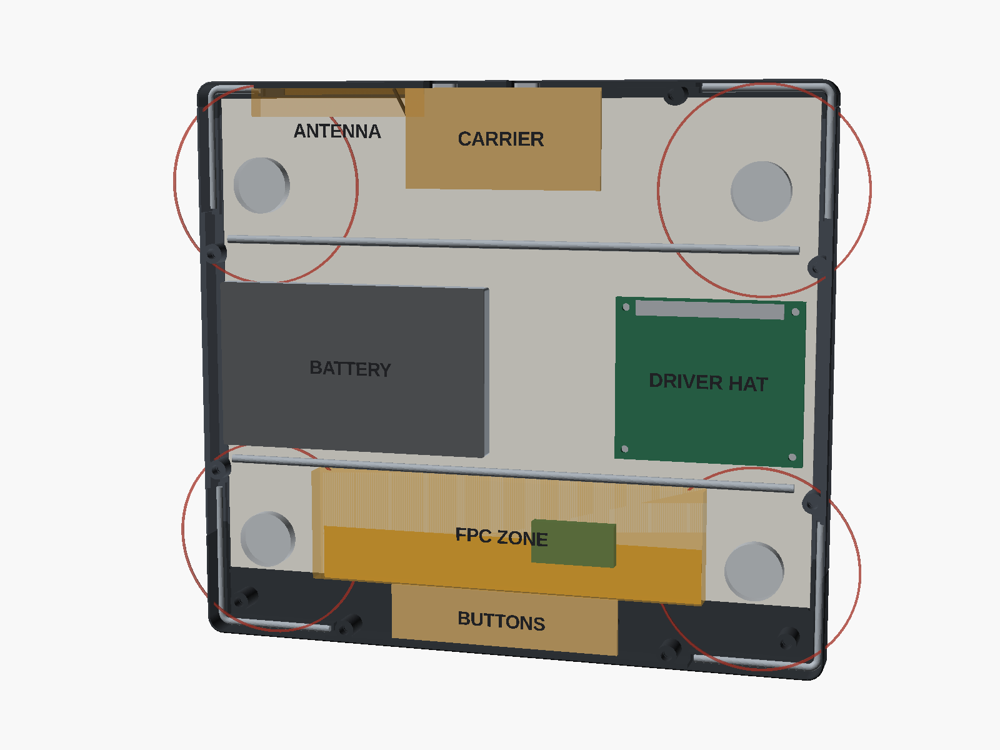
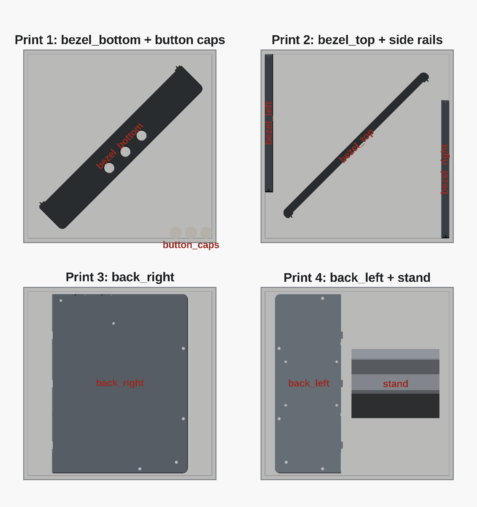

# brwr-trmnl enclosure

A thin printed frame for the 10.3" panel: 229 × 204 × 13 mm, plus the 1 mm
rubber pads on the back and caps 0.5 mm proud. The **bezel** holds the front
face, walls, panel pocket and buttons. The **back cover** carries the
electronics, the ribs that press the panel forward and four N52 disc magnets
sealed inside it. Steel rods epoxied into printed channels stiffen the thin
frame and splice the split parts. The frame sticks to a fridge door, to a
steel plate on a wall, or leans back 15° in the optional desk stand.

| Front | Back |
|---|---|
|  |  |
| **Exploded** | **Inside, back cover removed (seen from behind, so left and right are swapped)** |
|  |  |

The whole design is one parametric file, [`brwr-trmnl.scad`](brwr-trmnl.scad).
Running [`./export.sh`](export.sh) renders the STLs into `stl/` and these
pictures into `docs/images/`. It stops on any OpenSCAD warning, including a
failed design-rule check, and on any STL with open edges or zero-area
triangles.

## Parts

By default every part fits a **220 × 220 mm bed** (FlashForge Adventurer 5M)
with 5 mm margins. The bezel comes in four rails that meet at the window
corners. The back cover splits at X = −39.

| Part | File | Print orientation | Footprint on the bed | Size as printed | Mass |
|---|---|---|---|---|---|
| Top rail | `stl/bezel_top.stl` | front face down, turned 45° | 168 × 168 mm | 166 × 166 × 11.2 mm | ~10 g |
| Chin (bottom rail) | `stl/bezel_bottom.stl` | front face down, turned 45° | 188 × 188 mm | 186 × 186 × 11.2 mm | ~25 g |
| Left and right rails | `stl/bezel_left.stl`, `stl/bezel_right.stl` | front face down | 9.3 × 158 mm | 9.2 × 157.6 × 11.2 mm | ~8 g each |
| Back cover, left | `stl/back_left.stl` | outside face down | 77.5 × 204 mm | 77.5 × 204 × 9.4 mm | ~42 g |
| Back cover, right | `stl/back_right.stl` | outside face down | 154.5 × 204 mm | 154.5 × 204 × 9.4 mm | ~67 g |
| Button caps (3) | `stl/button_caps.stl` | face down | 48 × 13 mm | 48.2 × 13.4 × 4.1 mm | ~2 g |
| Desk stand (optional) | `stl/stand.stl` | base down | 100 × 79 mm | 100 × 78.8 × 73.6 mm | ~70 g |

The STLs are already in print orientation, including the 45° turn. The
footprint is what the bed-fit check measures: the rails' rounded outline,
turned. The model refuses a part that does not fit `bed_size` minus
`bed_margin`.

For a bed of **250 × 210 mm or more**, print the one-piece bezel and back
cover instead: `stl/one-piece/bezel.stl` (229 × 204 × 11.2 mm, ~51 g) and
`stl/one-piece/back.stl` (229 × 204 × 9.4 mm, ~110 g). `export.sh` renders them
with `split = false`. They carry the same grooves, bosses and rod channels.

Four print jobs on a 220 × 220 bed:

1. `bezel_bottom`, turned 45°, and the button caps
2. `bezel_top`, turned 45°, with `bezel_left` and `bezel_right`
3. `back_right`
4. `back_left` and the stand

Print in **PETG with 0.2 mm layers, 3–4 walls and 20 % infill, with no
supports**. Every overhang is 45° or bridged. That includes the rail scarfs,
the 45° fronts of the bosses behind the panel, the tab pockets and the cap
flanges. The bezel parts print on their front face, so use the sheet whose
finish you want on the front.

Masses are for PETG at 1.27 g/cm³: the STL volume, with a 1.2 mm solid shell
on every surface and 20 % infill inside it. At 13 mm deep everything is thin
wall, so it prints almost solid.

## Hardware

- **Screws**
  - 9 × M3 heat-set inserts, 4 mm long (hole Ø4.0 × 4 mm), in the bezel.
    Use 9 × M3 × 6 countersunk screws (ISO 10642) through the back cover.
  - 4 × M2.5 × 8 countersunk screws and 4 × M2.5 nuts for the driver HAT.
    The screws go in from outside, the nuts sit on the component side.
  - 2 × M2.5 × 6 countersunk screws and 2 × M2.5 nuts for the carrier board.
  - 2 × M2.5 heat-set inserts (hole Ø3.6 × 4.2 mm) behind the chin and
    2 × M2.5 × 5 pan-head screws for the button strip.
- **Magnets**
  - 4 × N52 disc magnets, 20 × 3 mm
  - 4 × steel discs, 20 × 1.5 mm
  - 2-part epoxy
  - 4 × self-adhesive rubber pads, Ø25 × 1 mm
- **Steel:** about 0.75 m of 3 mm mild steel rod (see the cut list below).
- **Switches:** 3 × Omron B3F-4000 (12 × 12 × 4.3 mm, flat plunger) on an
  84 × 20 mm protoboard strip.
- **Antenna:** Taoglas FXP831 (45 × 7 mm FPC, 100 mm of 1.37 mm coax, U.FL).
- **Foam:**
  - a 0.5 mm gasket on the window lip
  - 1 mm × 4 mm strips on the rib tops and the magnet tubes
  - a 0.5 mm pad under the battery
- **Zip ties:** 2.5 mm, for the button wires, through the three tie blocks at
  X = −30.
- **Glue (optional):** for the rail joints and the back seam. Use epoxy, or CA
  with a primer made for PETG.

### Steel rod cut list

| Rod | Shape | Straight lengths (mm) | Cut length |
|---|---|---|---|
| Back cover, upper (Y = 45.5) | straight | 206 | 206 mm |
| Back cover, lower (Y = −35.3) | straight | 206 | 206 mm |
| Bezel, top-left | L | 40 along the top wall + 40 down the side wall | 85 mm |
| Bezel, top-right | L | 15.5 along the top wall + 40 down the side wall | 61 mm |
| Bezel, bottom-left and bottom-right (2) | L | 40 along the bottom wall + 48 up the side wall | 93 mm each |

The bezel grooves follow the frame's rounded corner. Bend the L-rods 90° with
an inside radius of 1.3–1.9 mm, for example over a Ø3 mm pin in a vise. The
top-right rod's top leg is short so it stays 10 mm from the antenna. The
console prints this list (`CUT` lines) and asserts the rod rules:

- at least 8 mm from each rod to a magnet's edge (the upper back rod sits at
  exactly 8 mm)
- at least 10 mm to the antenna
- nothing in the flex zone (1.6 mm to spare)

## Z stack-up at 13 mm

Z is measured from the back face (the fridge side). These are the tightest
spots. The console prints them as `STACK` lines.

| Spot | Layers, Z in mm | Margin |
|---|---|---|
| Panel | front plate 11.4–13, gasket 10.9–11.4, panel 10.12–10.9, rib tops 9.42 plus 0.7 mm of squeezed foam | – |
| Carrier | recess floor 0–0.8, solder joints 0.8–2.0, board 2.0–3.6, charger USB-C to 8.6 | 1.52 mm to the panel |
| Driver HAT | plate 0–1.8, clipped header pins 2.3–3.3, standoffs to 3.3, board 3.3–4.9, parts and nuts to 7.9, screw tips at 8.0 | 2.22 mm to the panel |
| Battery | recess floor 0–0.6, foam 0.6–1.1, cell 1.1–7.1 | 2.32 mm to the rib tops |
| Buttons | recess floor 0–1.0, joints 1.3–3.3, strip 3.3–4.9, switch body to 8.4, plunger to 9.2, 0.2 mm gap, cap 9.4–13.5, sleeve 10.2–11.4 | 0.3 mm above the recess floor; the switch clicks after 0.45 mm with the cap face 0.05 mm proud |
| Magnets | skin 0–0.6, magnet 0.6–3.6, steel disc 3.6–5.1, epoxy to 5.4, tube to 9.42; rubber pad −1–0 | 4.7 mm to the panel |
| USB slots | XIAO centre 6.2 (slot 2.95–9.45), charger centre 6.8 (slot 3.55–10.05) | 1.45 mm below the front chamfer |
| Antenna | 4.4–11.4 on the top wall in a 0.3 mm recess, X 38–83 | 11.5 mm to the nearest metal |
| Rods | bezel rods 8.2–11.2, beside the panel edge; back rods 0.8–3.8, half sunk into the plate | – |

The console also prints what each stack needs as `DEPTH` lines. 13 mm closes.
The smallest depth that closes is **12.6 mm**, set by the buttons with 0.6 mm
of plate left under the strip. With a 1.0 mm sleeve that drops to 12.5 mm,
where the charger's USB-C plus 1 mm of air takes over. The model refuses a
`depth` that does not close.

## Assembly

1. **Inserts.** Heat-set the nine M3 inserts into the bezel rails' bosses and
   the two M2.5 inserts into the bosses behind the chin.
2. **Magnets.** In each back-cover pocket, drop in a magnet, lay a steel disc on
   it, and fill with epoxy to just over the disc. Nothing metal shows outside.
   Stick a rubber pad over each pocket on the outside face.
3. **Back cover.** Lay `back_left` and `back_right` outside face down on a flat
   table. Slide the three tabs on `back_left` into the pockets under
   `back_right`, so the scarf closes. Epoxy the two 206 mm rods into their
   channels across the seam; they hold the halves together. Glue on the scarf
   is optional.
4. **Bezel.** Lay the four rails front face down on a flat table and push them
   together at the corners. Each side rail slides in along Y between the top
   rail and the chin. The scarf and the half-lap line up the front faces and
   the pocket ledge. Epoxy the four L-rods into the corner grooves; they bridge
   the joints and are structural. Glue on the joint faces is optional. Let it
   cure flat.
5. **Buttons.** Push the caps in from behind, with the key toward the bottom.
   Then screw the switch strip onto its two bosses (M2.5 × 5).
6. **Panel.** Lay the gasket on the lip and drop the panel in face-down, with
   its flex at the chin. Fold the flex over the back of the panel. The zone
   144 × 40 mm above the panel's bottom edge is kept free of ribs and rods.
7. **Electronics.**
   - **Driver HAT:** remove its 2×20 header, clip the pins flush (≤ 1 mm) and
     remove the tall socket and pin headers. Mount it component side toward
     the panel on its four 1.5 mm standoffs, with M2.5 × 8 countersunk screws
     from outside and nuts on the component side.
   - **Carrier:** trim its joints to 1.2 mm. It rests on the two ledges of its
     recess and is held by M2.5 × 6 countersunk screws from outside, nuts on
     top. Measured from the board's top-left corner with the components facing
     you, one hole is 5 mm right and 5 mm down, the other 65 mm right and
     31 mm down.
   - **Battery:** on its foam pad in the cradle recess, lead out through the
     slot toward the middle.
   - **Antenna:** stick it into the recess on the inside of the top wall
     (X 38–83, front edge against the front plate). Run the coax over the
     carrier to the XIAO's U.FL.
8. **Close up.** Put foam strips on the rib pads and the magnet tubes, tie the
   button wires up the back at X = −30, and close the case with the nine M3
   screws. The two tongues on the back cover close the bottom of the USB
   slots.

**On a wall:** the back is too thin for keyholes. Screw a thin steel plate to
the wall, for example 1 mm galvanised steel of about 200 × 150 mm, or four
30 × 30 mm squares at the magnet positions (±90, ±65) from the frame's
centre. The magnets hold the frame on it.

## How the joints go together

- **Rail joints (bezel).**
  - Each joint runs level with the window's top or bottom edge (Y = 92.9 and
    Y = −64.7).
  - On the front it is a short line across the side border. It sits in a
    0.5 mm V-groove that continues over the front chamfer and down the side
    wall, so it reads as a deliberate line.
  - Through the front plate the joint is a 45° scarf. In the side wall, the
    outer half is cut straight and the inner half runs 4 mm further (a
    half-lap).
  - The rails register on each other and every rail prints face-down without
    supports.
  - The L-rods in the wall grooves bridge all four joints. The nearest other
    feature is 2.6 mm from a joint.
- **Back seam (X = −39).**
  - A 45° scarf through the plate, with 0.4 mm lands.
  - Three 2 × 8 × 0.8 mm tabs on `back_left` (at Y = −70, 0 and 55) slide
    into bridged pockets under `back_right`.
  - Both back rods cross the seam.
  - Clearances from the seam: 2.0 mm to the HAT standoffs, 1.5 mm to the HAT
    board edge and its countersinks, 2.4 mm to the carrier tray and 5 mm to
    the tie blocks.

## Changing the main parameters

Open the file in OpenSCAD and use the Customizer. Each dimension has a
comment with its unit and source. The console prints every module's position,
the stack-up, the magnet and rod distances and the rod cut list. The model
also runs `assert()` design rules and stops with a message when one fails.

- **Depth:** `depth`, `front_t` and `back_t`. The `DEPTH` lines say which
  stack sets the minimum.
- **Bed:** `bed_size`, `bed_margin` and `split`. `rail_angle` turns the long
  rails. `plate_layout()` places the parts of each print job and is checked
  for fit and spacing.
- **Magnets:** `mag_d`, `mag_h`, `steel_disc` and `mag_pos`, with one `[X, Y]`
  per magnet; the count is the number of entries. The rules are:
  - every centre is at least `mag_keep_board` (36 mm) from the driver and
    carrier boards, and at least `mag_keep_ant` (35 mm) from the antenna
    recess
  - magnets stay out of the flex zone and the battery cradle
- **Rods:** `rod_back_y`, `rod_back_x` and `rod_legs`. The rules are
  `rod_mag_clear`, `rod_ant_clear` and the flex zone.
- **Battery:** `bat_size = [L, W, T]` in landscape, and `bat_pos` for its
  centre.
- **Button feel:** `cap_preload` defaults to −0.2 mm, a free gap above the
  plunger, because the switch only travels 0.25 mm. Raise it toward 0 if the
  caps rattle. Lower it if a switch clicks by itself when the case is closed.

Use `part = "fit_check"` to see all module envelopes and rods inside a
see-through case. Use `part = "clash"` to render every overlap between the
printed parts, the modules and the rods. It is empty when everything fits,
and OpenSCAD reports "top level object is empty".

Coordinates follow the front view: X and Y are measured from the centre of the
outline (+X right, +Y up). Z is measured from the back face (the fridge side)
toward the front.

## Differences from the brief

- **Depth is 13 mm.** The first pass was 25 mm deep. The HAT lost its header,
  the carrier went low-profile and the switches went flat (see the stack-up).
- **9 M3 screws, not 10.** The L-rods take the corners of the top rail and the
  chin. There are only 3.35 mm between the pocket and the wall there, which is
  no room for both a rod and an insert.
  - The chin's corner screws moved in to (±101.5, −89.5).
  - The top rail has one screw at (−60, 97). There is none at the top right,
    because of the antenna keep-out.
  - The epoxied L-rods hold the top rail's corners.
- **The upper back rod is at Y = 45.5, not 46.** That keeps 8 mm from the rod
  surface to the magnet edge. The lower rod is at −35.3, centred between the
  battery cradle and the flex zone.
- **Two L-rods have different legs.** The top-right rod's top leg is 15.5 mm,
  to keep 10 mm from the antenna. The bottom rods' side legs are 48 mm, so they
  reach 17 mm past the joint.
- **The rod grooves are cut into the walls.** Along each bezel rod the wall is
  a 1 mm skin, and 0.5 mm under the joint's V-groove.
- **Some ribs changed.**
  - The rib at Y = −35 is gone; the lower rod runs there.
  - The bottom perimeter ribs are gone. The magnet tubes run up to the rib
    tops and carry foam instead.
  - The perimeter ribs moved 2.7 mm inside the panel edge to clear the rod
    grooves.
- **The M3 bosses reach under the panel's edge.** There they end
  0.3 mm behind the panel with a 45° front, so they print without supports.
- **The window chamfer is 1.1 mm,** to fit the 1.6 mm front plate.
- **The USB labels sit beside the slots.** There is no room above them in a
  13 mm wall.
- **Keyholes are removed.** The back is too thin; use a steel plate on the wall
  instead.
- **Two small features moved for the button strip's recess.** The logo moved
  to Y = −58, and the lowest zip-tie block is gone.
- **Kept from the first pass:**
  - magnets at (±90, ±65) under a 36 mm board rule (the brief had ±58 and
    30 mm)
  - a cap preload of −0.2 mm (a gap)
  - the cap keyway
  - the right carrier screw 4 mm above the board's bottom edge
  - USB slots open toward the back edge and closed by tongues
  - the engraved logo
  - the 144 mm flex relief
