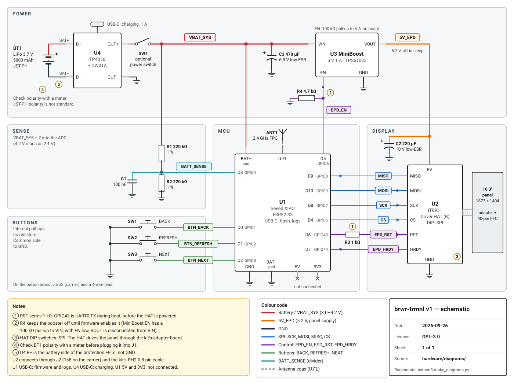
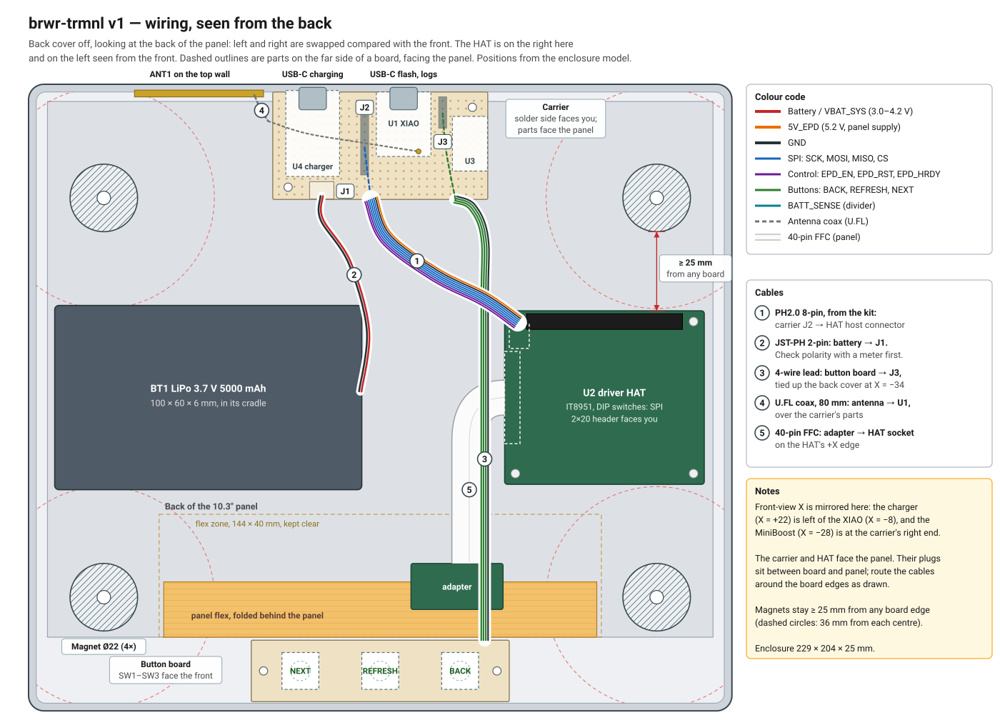
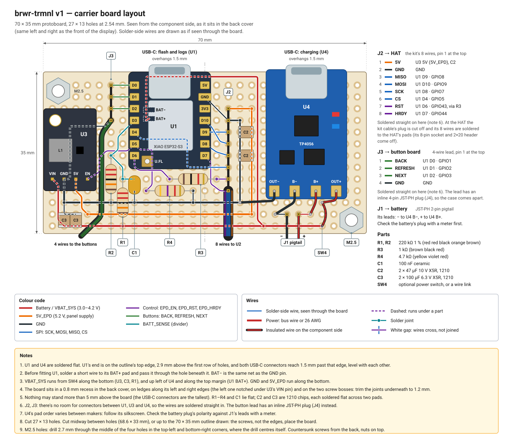
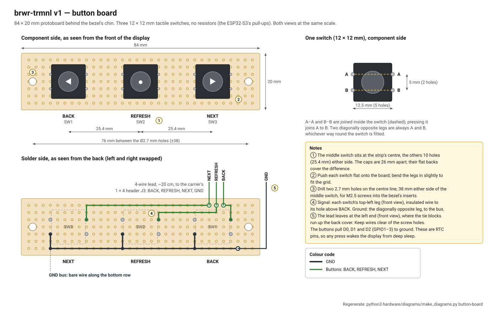

# Wiring

Everything sits on one hand-wired carrier board (70 × 35 mm protoboard) plus a
button strip. The display's driver HAT plugs into the carrier with the 8-wire
cable that comes in its box.

| | |
|---|---|
|  | The circuit ([schematic.svg](../docs/images/schematic.svg)) |
|  | Where everything goes, seen from the back with the cover off ([wiring.svg](../docs/images/wiring.svg)) |
|  | Carrier board layout ([carrier-layout.svg](../docs/images/carrier-layout.svg)) |
|  | Button strip ([button-board.svg](../docs/images/button-board.svg)) |

The diagrams are generated by the scripts in [`diagrams/`](diagrams/); edit
those rather than the SVGs.

## XIAO ESP32-S3 pins

| Pin | GPIO | Net | Goes to | Notes |
|---|---|---|---|---|
| D0 | 1 | BTN_BACK | SW1 BACK, other side to GND | Internal pull-up; wakes it from deep sleep |
| D1 | 2 | BTN_REFRESH | SW2 REFRESH, other side to GND | Internal pull-up; wakes it. Hold 5 s: Wi-Fi setup; 15 s: reset |
| D2 | 3 | BTN_NEXT | SW3 NEXT, other side to GND | Internal pull-up; wakes it |
| D3 | 4 | BATT_SENSE | R1/R2 midpoint, C1 to GND | Half the battery voltage |
| D4 | 5 | EPD_CS | HAT `CS` | |
| D5 | 6 | EPD_EN | MiniBoost `EN`, R4 4.7 kΩ to GND | High = panel powered |
| D6 | 43 | EPD_RST | R3 1 kΩ, then HAT `RST` | GPIO43 is the boot log's TX pin, hence the resistor |
| D7 | 44 | EPD_HRDY | HAT `HRDY` | Controller ready |
| D8 | 7 | EPD_SCK | HAT `SCK` | 12 MHz |
| D9 | 8 | EPD_MISO | HAT `MISO` | |
| D10 | 9 | EPD_MOSI | HAT `MOSI` | |
| BAT+ pad (back) | | VBAT_SYS | charger `OUT+` | Pad farther from the USB connector |
| BAT− pad (back) | | GND | charger `OUT−` | Pad nearer the USB connector |
| 5V, 3V3 | | | not connected | |
| U.FL | | | FPC antenna | Always plug the antenna in before Wi-Fi is on |

These match [`firmware/include/brwr/board.h`](../firmware/include/brwr/board.h)
and the `BOARD_BRWR_TRMNL` section of
[`firmware/include/config.h`](../firmware/include/config.h). If you change a
pin, change it there too. The three buttons must stay on GPIO 0–21 (the RTC
pins), or they can't wake the ESP32-S3.

## Power

```
 LiPo + ──► charger B+          charger OUT+ ──► (SW4) ──► VBAT_SYS ─┬─► XIAO BAT+
 LiPo − ──► charger B−          charger OUT− ──► GND                 ├─► MiniBoost VIN ──► 5 V ──► HAT 5V
                                                                     ├─► R1 220k ─┬─ R2 220k ─► GND
                                                                     │            └─► D3, C1 100 nF ─► GND
                                                                     └─► C3 470 µF ─► GND
```

- **All grounds go to the charger's `OUT−`,** never to `B−`. The charger
  module's protection switch sits between the two; wiring anything to `B−`
  bypasses it.
- **The MiniBoost only runs while the display draws.** The ESP32 drives its
  `EN` high (D5), then low again before sleeping. R4 holds it off while the
  ESP32 boots. With `EN` low its output is disconnected from the battery,
  so the HAT gets nothing.
- **Capacitors:** C3 (470 µF) at the MiniBoost's input and C2 (220 µF) at the
  HAT's `5V` pin carry the current surge when the panel's power supply
  starts, so the battery voltage doesn't dip and reset the ESP32. Mind their
  polarity: the stripe is `−`.
- **Wire:** 26 AWG for the battery, `VBAT_SYS`, 5 V and ground runs; 28–30 AWG
  for signals. Keep the 5 V and ground to the HAT short and twisted together.
- **SW4** (optional) switches everything off for storage. Charging still
  works with it off, because the charger sits before it.

## The HAT

- **Interface switch: SPI.** The HAT has a small switch or DIP switches for
  SPI, I80 and I²C. Set it to SPI before powering it.
- **Cable:** the 8-wire PH2.0 cable in the box, with the white plug in the HAT
  and the separate sockets on the carrier's 1 × 8 header, in the order
  printed on the carrier layout: 5V, GND, MISO, MOSI, SCK, CS, RST, HRDY.
  Match the wire labels on the HAT's silkscreen, not the wire colours.
- **Panel:** the 40-pin flat cable goes from the small adapter board to the
  HAT. Lift the connector latch, slide the cable in square, contacts facing
  the right way (check the photos in Waveshare's manual), and close the latch.
- **VCOM:** the panel's ribbon cable has a label with a voltage such as
  `-1.52V`. Enter it on the setup page (or later in Home Assistant). Each panel
  is different; the wrong value gives a washed-out or smudgy picture.

## Checks before the first power-up

1. **Battery polarity.** JST-PH batteries don't all use the same polarity.
   Measure the plug with a meter: red must reach the socket pin that goes
   to charger `B+`. Reversed, it destroys the charger module (and possibly
   more).
2. **No shorts:** with nothing plugged in, measure resistance between
   `VBAT_SYS` and GND (it should climb slowly as C3 charges from the meter,
   not read 0 Ω), and between the HAT's `5V` and GND.
3. **5 V switch:** with the battery connected and no firmware yet (or D5
   low), the MiniBoost output must read 0 V. It turns on only when the
   firmware draws.
4. **Battery sense:** D3 should read half the battery voltage.

Then flash the firmware ([build guide](../docs/build-guide.md)).
